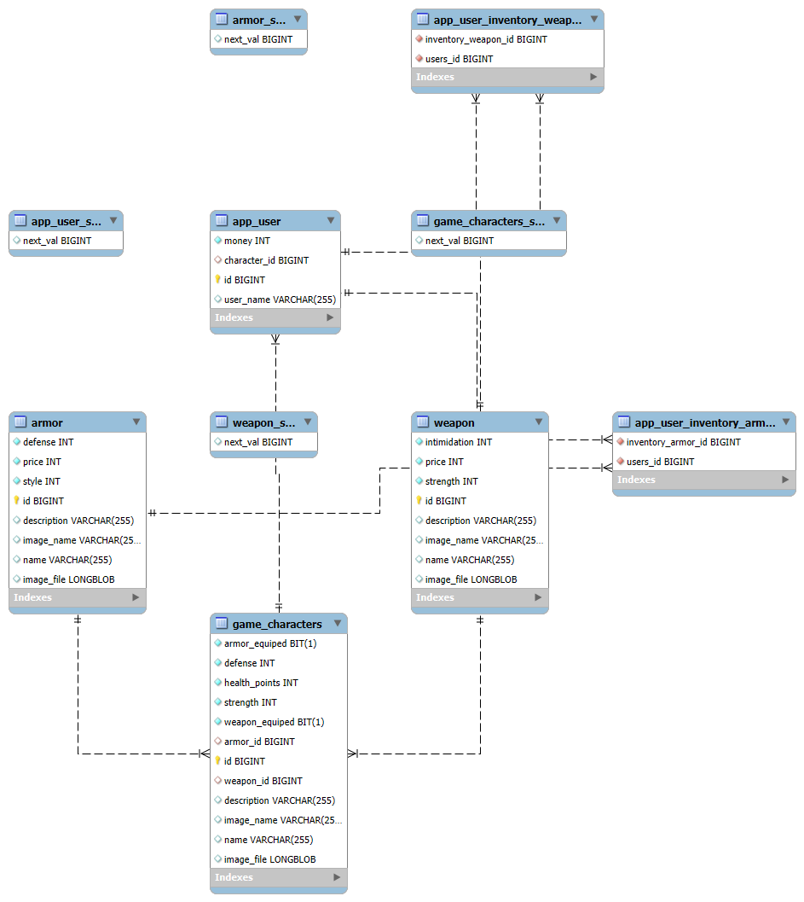

# Dado 13

| Nombre | Correo universitario | Github |
|--------|----------------------|--------|
| Pablo Ratón Macías | p.raton.2023@alumnos.urjc.es | praton2023 |
| Andrea Isabel Rodriguez Ochoa | a.rodriguez.2023@alumnos.urjc.es | dreamrcurio |
| Lucas Lotti Villar | l.lotti.2023@alumnos.urjc.es | LotusLupe |
| Eduardo Moreno Arollo | e.moreno.2023@alumnos.urjc.es | E-ed-bot |

## Entidades:
- **User**
- **Character**
- **Weapon**
- **Armor**

## Relaciones:
- **User - Character:** 1/1  
- **User - Weapon:** 1/N  
- **User - Armor:** 1/N  
- **Character - Weapon:** 1/1  
- **Character - Armor:** 1/1  

## Tipos de usuario y permisos

### Por defecto:  
Usuario sin registrar, interactúa mínimamente con la página. No puede comprar o equipar objetos, pero sí puede ver los objetos de la tienda o el perfil del resto de jugadores.

### Jugador:  
Usuario registrado, puede obtener monedas, comprar objetos, equiparlos y actualizar su perfil.

### Administrador:  
Usuario con permisos elevados, puede acceder al `/admin` para crear objetos o modificarlos, además de acceder y modificar el perfil o inventario de los usuarios.

## Imágenes en entidades
|Entidad |   Imagenes   |
| ------------ | ------------ |
|  User | 0  |   
| Character   | 1  |   
|  Weapon |  1 |   
|  Armor |  1 |   
## Diagrama de la BBDD

## Trabajo de cada integrante (JUNIO)
### Pablo
Fix de búsqueda dinámica, funciones /admin, imagenes en disco, sanitización, solución de errores.
#### 5 archivos más modificados:
`AdminController.java`, `SessionController.java`, `userService.java`, `ImputSanitizer.java`,`characterService.java`.
#### 5 commits destacados
https://github.com/DWS-2025/project-grupo-13/commit/38188246819b543ab304923c5efe0f5b8aa3b26d
https://github.com/DWS-2025/project-grupo-13/commit/a33246259a76126c0c5888332bfd2e5c6528b7a6
https://github.com/DWS-2025/project-grupo-13/commit/c8c2fa8741b32f33f66e73bec1df5598cde5d602
https://github.com/DWS-2025/project-grupo-13/commit/0ebaa14ad92793f745680a9b57aeab0dc6f0d6e5
https://github.com/DWS-2025/project-grupo-13/commit/b1f52b3ad3b4e8ac21a4137be774faead073c15a
### Andrea
Introducción DTOs, manejo de DTOs, funciones de gestión de usuarios, pagina del perfil de usuario e y sus implementaciones, solución de errores.

#### 5 archivos más modificados:
`CharacterService.java`, `SessionController.java`, `grupo13RestController.java`, `UserService.java`,`profile.html`.

#### 5 commits destacados
https://github.com/DWS-2025/project-grupo-13/commit/6560b9fc6872dcc9787afa0953d896023c55bf2f

https://github.com/DWS-2025/project-grupo-13/commit/450dd12bb716df8f2838e60bfbd9248cf36616e7

https://github.com/DWS-2025/project-grupo-13/commit/7fd56b350cc1ae10fb9b25dab1f3028913fd4e35

https://github.com/DWS-2025/project-grupo-13/commit/634ce7cc6580ab9943cfd087886008575ff42a1e

https://github.com/DWS-2025/project-grupo-13/commit/9feaa3c12db45bbcee9bc0b171b4dadf1d3e1004

### Lucas
Carpeta de seguridad, users y adaptar la web al manejo de users. Añadir funcionalidades y htmls para la gestión de seguridad y usuarios; implementacion de nuevas funciones en API REST y protección de esta.

#### 5 archivos más modificados:
`Security Config`, `Session Controller`, `User Service`,`Grupo13RestController`,`CharacterService`.
#### 5 commits destacados
https://github.com/DWS-2025/project-grupo-13/commit/6ca70715035b878856bf48d439d18345f1e4e4a4
https://github.com/DWS-2025/project-grupo-13/commit/444ef3ce6ef77ab5322d52f91668054b93e506f6
https://github.com/DWS-2025/project-grupo-13/commit/c3d197fa201f6d04b39e3b5c5651b6ffaa93401c
https://github.com/DWS-2025/project-grupo-13/commit/cf737d3a01dd1ad1dc6c25cc8c24089de674e4c5
https://github.com/DWS-2025/project-grupo-13/commit/6f153b981393b80b23f9c5108f0fbac36a08a316
### Eduardo
paginación y compra de objetos (tienda); cargar objetos predeterminados (SampleData); detalles de formato, tabulaciones, estilos, etc; corrección de errores (pasar botones a forms, capar campos en formularios para la bd, errores al eliminar/editar entidades...)
#### 5 archivos más modificados:
`SampleData.java` `listing_armors.html` `listing_weapons.html` `sessionController.java` `userService.java`
#### 5 commits destacados
https://github.com/DWS-2025/project-grupo-13/commit/b96187487af726e111c14ad4682791b468e77740
https://github.com/DWS-2025/project-grupo-13/commit/9fb856d5e7e3285b3dec4c670111ea73f7c21956
https://github.com/DWS-2025/project-grupo-13/commit/f0c37ae5da0fab9b62531bf17e80fd3fca7b5626
https://github.com/DWS-2025/project-grupo-13/commit/3fcbff24984ec7952e22335b476423b5223fa700
https://github.com/DWS-2025/project-grupo-13/commit/e76ab6a52c72b18eca1d28ef781aa60753b6fa51
## Trabajo de cada integrante (FASE 3)
### Pablo
Busqueda dinámica, filtros de archivos, blacklists/whitelists, protección path traversal, solución de errores.
#### 5 archivos más modificados:
`AdminController.java`, `SessionController.java`, `GlobalModelAttributes.java`, `ImputSanitizer.java`,`grupo13RestController.txt`.

#### 5 commits destacados
https://github.com/DWS-2025/project-grupo-13/commit/8944da68d084aa37b248b3129db1b4b25ac018aa

https://github.com/DWS-2025/project-grupo-13/commit/2e6816c22cdc3c4137edf0dca10ebe981225849d

https://github.com/DWS-2025/project-grupo-13/commit/049f04daeaf27f5f43d0c84e28a676b9bd8a5b02

https://github.com/DWS-2025/project-grupo-13/commit/e285e2561d388f873bac296016de20b0cdea7073

https://github.com/DWS-2025/project-grupo-13/commit/d4c6413b1b875cd9e38f7489dce236d14a0abb7d
### Andrea
Introducción DTOs, manejo de DTOs, funciones de gestión de usuarios, solución de errores.
#### 5 archivos más modificados:
`CharacterService.java`, `SessionController.java`, `grupo13RestController.java`, `UserService.java`,`edit_user.html`.
#### 5 commits destacados
https://github.com/DWS-2025/project-grupo-13/commit/6560b9fc6872dcc9787afa0953d896023c55bf2f

https://github.com/DWS-2025/project-grupo-13/commit/450dd12bb716df8f2838e60bfbd9248cf36616e7

https://github.com/DWS-2025/project-grupo-13/commit/7fd56b350cc1ae10fb9b25dab1f3028913fd4e35

https://github.com/DWS-2025/project-grupo-13/commit/342293550c3a69d7bba4830d05ec0c3fe80ffc61

https://github.com/DWS-2025/project-grupo-13/commit/2199e8c4d85d7b97b4c36cbbdc43ec6297816628

### Lucas
Carpeta de seguridad, users y adaptar la web al manejo de users. Añadir funcionalidades y htmls para la gestión de seguridad y usuarios
#### 5 archivos más modificados:
`Security Config`, `Session Controller`, `User Service`,`Grupo13RestController`,`CharacterService`.
#### 5 commits destacados
https://github.com/DWS-2025/project-grupo-13/commit/c3d197fa201f6d04b39e3b5c5651b6ffaa93401c

https://github.com/DWS-2025/project-grupo-13/commit/cf737d3a01dd1ad1dc6c25cc8c24089de674e4c5

https://github.com/DWS-2025/project-grupo-13/commit/5393ffd7fa9481ace0d7e18047ddf79e43a3abfd

https://github.com/DWS-2025/project-grupo-13/commit/b9e5f7c50f9f17d1781c1cab8d62230cf4a8f7be

https://github.com/DWS-2025/project-grupo-13/commit/5e7629afb61c8f212262a2a87b1d5f8a5dd2d62f
### Eduardo
Paginacion, solucion de errores
#### 5 archivos más modificados:
`AdminController.java`, `SessionController.java`, `new_armor.html`, `new_weapon.html`,`WeaponService.java`.
#### 5 commits destacados
https://github.com/DWS-2025/project-grupo-13/commit/3bd23374444ff168393cb14ba9d99457613cb940

https://github.com/DWS-2025/project-grupo-13/commit/4e49c7ff7665bbddac77108feaa1714e2b739d22

https://github.com/DWS-2025/project-grupo-13/commit/7a98d0b7eccf0a09bc8d042dc6b838aa4d4b937f

https://github.com/DWS-2025/project-grupo-13/commit/c03ad56d24ff46d0f8c0dafd8d9e7369bf225c0b

https://github.com/DWS-2025/project-grupo-13/commit/c44e3961cf53e9c9dbef9bc0ef44e4a0052ec779
## Trabajo de cada integrante (FASE 2)
### Pablo
Eliminacion de herencia en equipment, traspaso de varias clases a BBDD, readme.md, consultas dinámicas js en equipment manager del /admin, consultas en postman, correción de errores
#### 5 archivos más modificados:
`AdminController.java`, `editArmor.html`, `weaponService.java`, `eqmanager.js`,`readme.txt`.

#### 5 commits destacados
ELIMINACION DE HERENCIA (BRANCH ELIMINADA)

https://github.com/DWS-2025/project-grupo-13/commit/1397ea401d59cbd9361fb1879256d7f1258f8095

https://github.com/DWS-2025/project-grupo-13/commit/5e83b41b63eb1a8dc3306829b6a1bc7ef3b89f58

https://github.com/DWS-2025/project-grupo-13/commit/4acfd93e62a96c380ea046ffd31f6416a2755cac

https://github.com/DWS-2025/project-grupo-13/commit/a00edba25a4756915fcc4d665fb7b8c34d063256

### Andrea
Eliminación de herencia equipment, creación de la base de datos, adición de DTOs, corrección de errores sobre todo en el AdminController
#### 5 archivos más modificados:
`AdminController.java`, `header.html`, `ArmorService.java`, `Weapon.java`,`WeaponService.java`.
#### 5 commits destacados:
https://github.com/DWS-2025/project-grupo-13/commit/8bab4da0ed9483380d1359565beab7fbd0453d1b

https://github.com/DWS-2025/project-grupo-13/commit/6db2c727396ecd90ddef913a8bbaa0f9b79faba7

https://github.com/DWS-2025/project-grupo-13/commit/7e11e3eed3092e27b1d90885f02c97f24ae65078

https://github.com/DWS-2025/project-grupo-13/commit/3087aedeed0062243bbdeca4b8e717dbddfc200a

https://github.com/DWS-2025/project-grupo-13/commit/1e46a3b3e2c2ccdc55dc177cb4bb7736471b92a4

### Lucas
Muchas soluciones de errores, implementación base de datos de character y de la api rest, así como edición de los servicios para adaptarlos a los cambios que van saliendo

#### 5 archivos más modificados:
`listing.html`, `characterService.java`, `sessionController`,`index.html`,`restController.java`
#### 5 commits destacados:
https://github.com/DWS-2025/project-grupo-13/commit/6f153b981393b80b23f9c5108f0fbac36a08a316

https://github.com/DWS-2025/project-grupo-13/commit/01ae246e87606bd00cfbdea50f0f95146e62ae22

https://github.com/DWS-2025/project-grupo-13/commit/cd9d74e4fe4ab563405a3887f3b93471480a63de

https://github.com/DWS-2025/project-grupo-13/commit/753fb16195c1a28d4cdcff8584226d051a431a9d

https://github.com/DWS-2025/project-grupo-13/commit/f9314ad71f3ee161ab792c5d29711cb4367cffa3

### Eduardo
Comentarios, homogeneizar el formato (saltos de línea, espacios entre métodos...), revisión de errores en el código y base de datos, paginación de la tienda y separación entre weapon y armor de la tienda.
#### 5 archivos más modificados:
`listing_armors.html`, `listing_weapons.html`, `sessionController.java`, `User.java`,`WeaponService`.

#### 5 commits destacados
https://github.com/DWS-2025/project-grupo-13/commit/4db88a1f3f191f0e63d9cb1be47086e70661ea44

https://github.com/DWS-2025/project-grupo-13/commit/5f7699fc83891576ea5e81531aacff0cb965d100

https://github.com/DWS-2025/project-grupo-13/commit/4a5d344

https://github.com/DWS-2025/project-grupo-13/commit/1774d86f5e0d8ae33e9a71ae81fc3e8ef07c407b

https://github.com/DWS-2025/project-grupo-13/commit/0d11dee